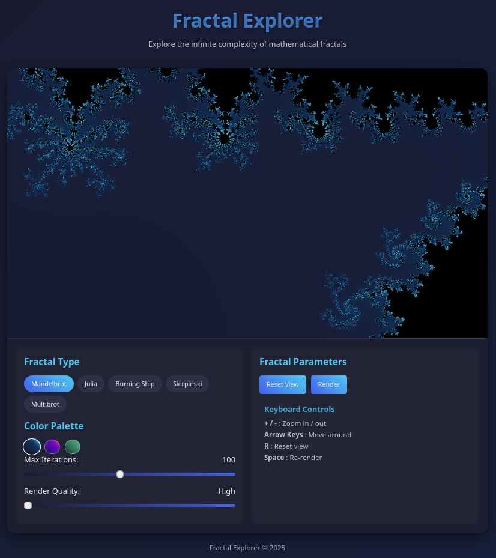
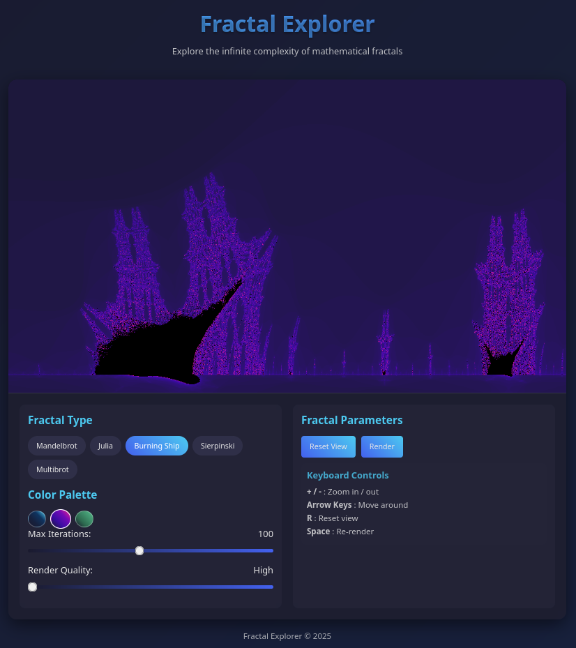
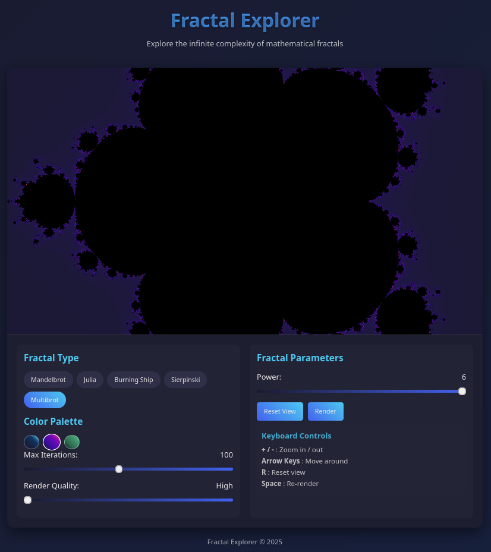

# Day 8: Vibe Coding

## Project: Interactive Fractal Explorer

A responsive, interactive fractal explorer built with vanilla JavaScript and HTML5 Canvas. The application allows users to explore various mathematical fractals through an intuitive keyboard-controlled interface.

### Features
- **5 Fractal Types**: Mandelbrot Set, Julia Set, Burning Ship, Sierpinski Triangle, and Multibrot Set
- **Keyboard Navigation**: Use +/- for zoom, arrow keys for movement, R to reset, Space to re-render
- **Dynamic Parameters**: Real-time sliders for fractal-specific parameters
- **Color Palettes**: Multiple artistic color schemes (Ocean, Sunset, Forest)
- **Performance Controls**: Quality settings for smooth rendering

## Generated Visuals

### Fractal Screenshots
*Placeholder for Mandelbrot Set visualization*

*Placeholder for Julia Set visualization*

*Placeholder for Burning Ship visualization*

*Placeholder for Multibrot Set visualization*

## Usage
1. Open `fractal.html` in any modern web browser
2. Use keyboard controls to navigate and explore fractals
3. Adjust parameters using the sliders
4. Switch between different fractal types and color palettes
5. Experiment with different quality settings for performance optimization

## Prompt Used
> Create a single, self-contained HTML file (no external libraries, no build tools) that implements a responsive, interactive fractal explorer using vanilla JavaScript and HTML5 Canvas. The app must be simple to run, visually appealing, and performant. 
 
>  Features (Realistic & Achievable): 
> 1. Fractal Types (4–5 Total – Quality Over Quantity) 

> Support these 5 well-known fractals: 
    Mandelbrot Set
    Julia Set (with c_real and c_imag sliders)
    Burning Ship Fractal
    Sierpinski Triangle (recursive, depth-controlled)
    Multibrot Set (generalized Mandelbrot with power slider)
    Users can switch between them via a dropdown menu or tab buttons. 
> 2. Sliders for Parameters 
    Show only relevant sliders based on the selected fractal.
    Sliders use <input type="range"> with custom CSS styling:
        Smooth gradient track
        Rounded handles
        Real-time value display (e.g., "C Real: 0.3")
        Responsive and mobile-friendly
> Examples: 
    Julia: c_real, c_imag
    Multibrot: power (from 2 to 6)
    Sierpinski: depth (from 1 to 8)
    Burning Ship: max_iterations (from 50 to 300)
> 3. Zoom & Pan Controls 
    Mouse wheel: zoom in/out around cursor position
    Click + drag: pan across the complex plane
    Double-click: reset to default view
    Maintain aspect ratio so image stays square or fits screen without distortion
> 4. Canvas Display & Image Ratio 
    Canvas fills available space while maintaining correct aspect ratio (use object-fit: contain or centering).
    No stretching or cropping.
    Always shows the entire fractal at a readable scale.
> 5. Natural, Harmonious Colors (No Flashy Colors!) 
    Use soft, artistic palettes inspired by nature:
        Gradient from deep blue → purple → gold → soft white
        Avoid neon, sharp contrasts, or rainbow glitches
    Apply color smoothly using HSL interpolation
    Add subtle noise or dithering to reduce banding
    Allow user to toggle between 2–3 preset palettes (e.g., “Ocean”, “Sunset”)
> 6. Performance & Animation 
    If rendering takes longer than ~100ms:
        Show a simple loading animation: pulsing circle or gradient wave
        Render in chunks using requestAnimationFrame to avoid freezing
    Include a “Render Quality” slider (Low/Medium/High) to control speed vs detail
> 7. UI/UX Design 
    Clean, dark-themed interface
    Sliders are clearly labeled and visually polished
    Fractal selector at top
    Reset button
    Tooltips on hover (using title or small popups)
    Mobile-responsive layout (works on phones/tablets)
> 8. Code Structure 
    Single HTML file with embedded style and script
    Use canvas, 2D context, and requestAnimationFrame
    Modular functions:
        renderFractal()
        updateSliders()
        handleMouseWheel()
        applyColorPalette()
> Final Deliverable: 
> A single .html file that runs in any modern browser — no installation, no dependencies — that lets users: 
    Switch between 5 fractals
    Adjust parameters with intuitive sliders
    Zoom and pan interactively
    See beautiful, natural-looking fractals with smooth rendering
    Goal: A beautiful, fast, and fun fractal viewer — simple enough to fit in one file, powerful enough to impress.
